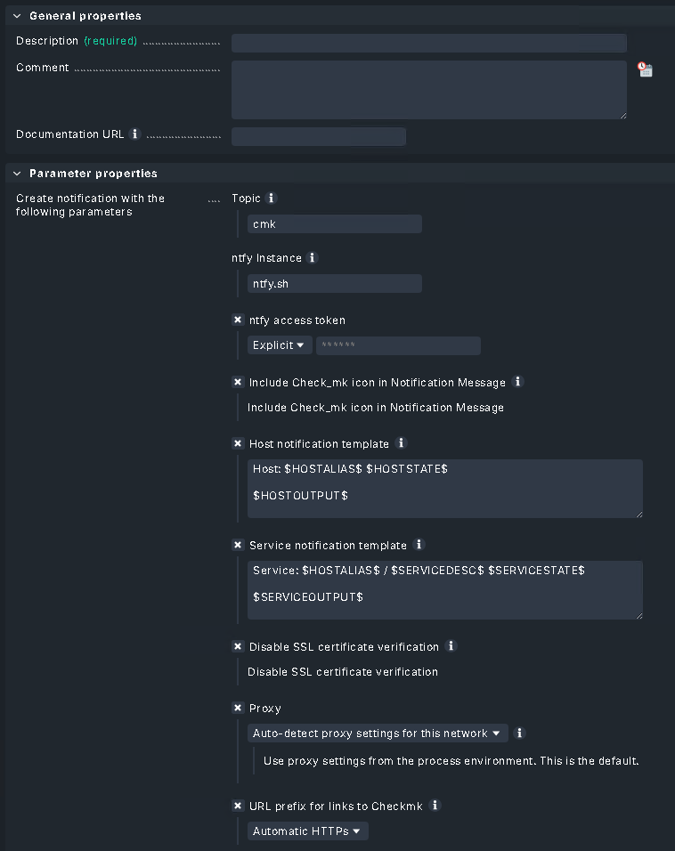

# cmk2ntfy

This extension provides a modernized notification plugin for [ntfy](https://ntfy.sh), enabling push        
notifications from Checkmk to any ntfy instance. Built for Checkmk 2.3, 2.4, and 2.5.

[Checkmk Exchange](https://exchange.checkmk.com/p/cmk2ntfy)

Configurable Parameters:
* Topic (Required)
* ntfy Instance (Required, defaults to ntfy.sh)
* Access Token (Optional: for private topics)
* Host/Service Message Templates (Optional: macro support)
* Include Checkmk icon (Optional)
* URL Prefix for links (Optional: auto-detected)
* Disable SSL verification (Optional: for self-signed certs)
* HTTP Proxy support (Optional)

This Plugin is based on [Notifications via ntfy](https://exchange.checkmk.com/p/notify-via-ntfy)
